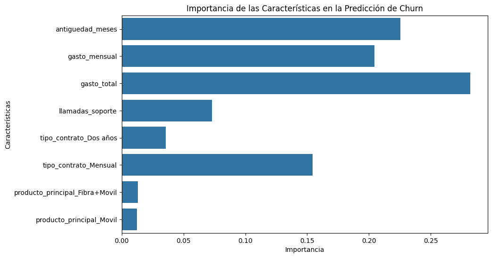

# Proyecto de Predicción de Fuga de Clientes (Churn)

## 1. Contexto del Problema

Este proyecto simula un caso de negocio real para la empresa de telecomunicaciones ficticia. La empresa enfrenta un problema crítico: una tasa creciente de cancelación de contratos por parte de sus clientes (fenómeno conocido como *Customer Churn* o fuga de clientes).

Perder clientes no solo implica una pérdida de ingresos directos, sino que también tiene un alto coste asociado a la adquisición de nuevos clientes para reemplazarlos.

## 2. Objetivo del Proyecto

El objetivo principal es desarrollar un modelo de **Machine Learning** capaz de **identificar de forma proactiva a los clientes con una alta probabilidad de darse de baja el próximo mes**.

Además de la predicción, un segundo objetivo es entender los **factores clave** que influyen en la decisión de un cliente de abandonar la compañía, para así poder proponer acciones de retención estratégicas y personalizadas.

## 3. Tecnologías Utilizadas

*   **Lenguaje de Programación:** Python 3.x
*   **Librerías de Análisis de Datos:** Pandas, NumPy
*   **Librerías de Visualización:** Matplotlib, Seaborn
*   **Librerías de Machine Learning:** Scikit-learn

## 4. Metodología

El proyecto se estructuró siguiendo el flujo de trabajo estándar de un proyecto de Data Science:

### a. Análisis Exploratorio de Datos (EDA)
Se realizó una investigación inicial de los datos para entender su estructura, detectar valores nulos y, lo más importante, visualizar la relación entre las diferentes variables y la variable objetivo (`churn`).

**Hallazgos clave del EDA:**
*   Los clientes con **contratos mensuales** tienen una tasa de fuga significativamente mayor que los clientes con contratos anuales.
*   La **antigüedad** es un factor determinante: los clientes nuevos son mucho más propensos a irse.
*   Un alto número de **llamadas a soporte** parece estar correlacionado con una mayor probabilidad de fuga.

### b. Preprocesamiento de Datos
Se prepararon los datos para el modelo, incluyendo:
*   Conversión de la variable objetivo a formato numérico (0/1).
*   Eliminación de columnas no informativas (`customerID`) para evitar fuga de datos (Data Leakage).
*   Codificación de variables categóricas (como `tipo_contrato`) a formato numérico usando `One-Hot Encoding`.

### c. Modelado
Se dividieron los datos en conjuntos de entrenamiento (80%) y prueba (20%). Se eligió un modelo **`RandomForestClassifier`** por su buen rendimiento y su capacidad para proporcionar la importancia de las variables.

### d. Evaluación del Modelo
El rendimiento del modelo se evaluó en el conjunto de prueba, con un enfoque especial en la métrica de **Recall**, ya que para el negocio es más costoso no identificar a un cliente que se va (Falso Negativo) que ofrecer un descuento a un cliente que no pensaba irse (Falso Positivo).

## 5. Resultados

El modelo final demostró un rendimiento sólido y realista en los datos de prueba:

| Métrica            | Puntuación | Interpretación de Negocio                                                                    |
| :----------------- | :--------- | :------------------------------------------------------------------------------------------- |
| **Accuracy**       | **80%**    | El modelo clasifica correctamente al 80% del total de clientes.                              |
| **Precision (Churn=Sí)** | **68%**    | De los que predijimos que se irían, el 68% realmente lo hizo.                                |
| **Recall (Churn=Sí)**    | **87%**    | **¡Métrica Clave!** Logramos identificar al 87% de todos los clientes que realmente se fueron. |

**Matriz de Confusión:**
```
[[ 19, 6],
 [ 2, 13]]
```
*   **Falsos Negativos (2):** Solo se nos "escaparon" 2 clientes que se dieron de baja. ¡Un gran resultado para el negocio!

## 6. ¿Por qué se van los clientes?

El análisis de importancia de variables nos permitió abrir la "caja negra" del modelo y entender los factores más influyentes:



Los 4 factores más determinantes fueron:
1.  **Gasto Total (`gasto_total`)**: El valor histórico del cliente.
2.  **Antigüedad (`antiguedad_meses`)**: Cuánto tiempo lleva el cliente con nosotros.
3.  **Gasto Mensual (`gasto_mensual`)**: El importe de la factura mensual.
4.  **Tipo de Contrato Mensual**: Si el cliente no tiene un compromiso de permanencia.

## 7. Recomendaciones Estratégicas

Basado en los resultados del modelo, se proponen las siguientes acciones de negocio:

*   🎯 **Campaña "Primer Año Crítico":** Enfocar los esfuerzos de retención (descuentos, seguimiento personalizado) en clientes con **menos de 12 meses de antigüedad**.
*   🤝 **Estrategia de Anualización:** Crear una campaña agresiva para **migrar a los clientes de "Contrato Mensual"** a un plan anual con beneficios, asegurando así su permanencia.
*   📊 **Revisión de Valor:** Investigar si los clientes con **mayor gasto mensual** perciben un valor adecuado por el precio, y considerar añadir beneficios adicionales a los planes premium.

## 8. Cómo Ejecutar el Proyecto

1.  Clonar el repositorio: `git clone https://github.com/tu-usuario/proyecto-prediccion-churn.git`
2.  Navegar al directorio del proyecto.
3.  Instalar las dependencias (se recomienda crear un entorno virtual): `pip install -r requirements.txt`
4.  Ejecutar el Jupyter Notebook: `jupyter notebook Churn_Analysis.ipynb`
